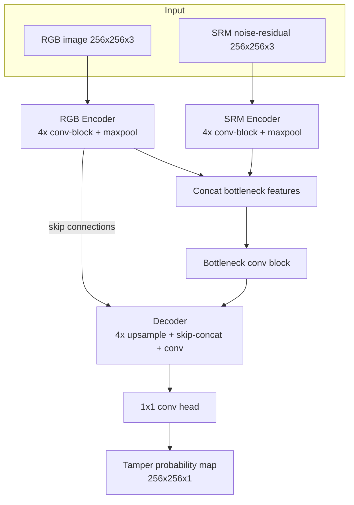

# Momus — Document Forgery Detection & Localization

> *Named for the Greek god of blame and fault-finding, whose entire mythological role was to pick apart the flaws in the work of gods and mortals alike.*

A dual-stream segmentation model that detects **and pixel-localizes** tampering in identity documents (ID cards, receipts, salary slips) — copy-move, region splicing, text/field substitution, and inpainting-based removal — under realistic phone-photo degradation (JPEG recompression, downscaling, blur, screen-recapture moiré).

Built as a zero-budget project: runs fully on free Kaggle/Colab T4 GPU (or CPU, slowly) with either real public datasets or a fully offline synthetic-document fallback.

---

## Problem statement

Identity verification pipelines (KYC onboarding, loan document review, insurance claims) increasingly need to catch **tampered documents** before they reach downstream systems — a swapped date of birth, a copy-moved photo, a spliced-in field from another document, or a digitally removed watermark/stamp. A binary "real/fake" classifier isn't enough in practice: reviewers need to know **where** on the document the tampering happened, so they can verify the specific field.

This project frames the task as **binary segmentation**: given a document image, output a per-pixel probability map of tampering, evaluated with pixel-level IoU/F1, image-level detection AUC, cross-manipulation generalization, and robustness to real-world image degradation.

---

## Datasets

| Dataset | What it provides | License / access notes |
|---|---|---|
| **MIDV-500** | 500 video clips of 50 identity document types (synthetic/mock IDs, not real people's documents) | Research use, hosted via Smart Engines FTP mirror — see [project page](http://l3i-share.univ-lr.fr/MIDV2020/midv2020.html) |
| **MIDV-2020** | Extended version of MIDV-500 with more document types and annotations | CC BY 4.0, research use — hosted at l3i-share.univ-lr.fr |
| **SROIE** | Scanned receipts with OCR + key-field annotations | Released for ICDAR 2019 SROIE competition, research use — [rrc.cvc.uab.es](https://rrc.cvc.uab.es/?ch=13) |

**Important — read before running `data/download.py` on a fresh machine:** these hosts sometimes gate access behind a manual, non-programmatic click-through ("I agree to research-only use") rather than a direct file link, and mirrors change over time. In this sandboxed development environment, both hosts returned `HTTP 403 Forbidden` on the automated attempt. `data/download.py` handles this by:

1. Trying the known mirrors with a short timeout.
2. **Automatically falling back to an offline synthetic document generator** (`data/synthetic_docs.py`) if real download fails — procedurally-drawn card-shaped images with fake field labels, a placeholder photo box, and a background texture. These are clearly **not** real ID documents; they exist purely to exercise the full pipeline (forgery generation → training → eval → deploy) end to end without a network dependency.

**For real results, you must either:**
- Run `data/download.py` with full, unrestricted internet access (works from most personal machines / Colab), or
- Manually download MIDV-500/2020 + SROIE per their project pages and place extracted images under `data/raw/<dataset_name>/`, then adapt `data/download.py`'s normalization step to point at them.

---

## Architecture



- **RGB stream** learns semantic/appearance cues (a photo box that looks pasted in, inconsistent lighting, mismatched fonts).
- **SRM stream** ([Fridrich & Kodovsky, 2012](https://ieeexplore.ieee.org/document/6197267) steganalysis kernels) computes a 3-channel high-pass noise-residual map — tampered regions often leave faint high-frequency inconsistencies invisible in raw RGB but visible after high-pass filtering. This is the same family of signal used in forensics papers like RGB-N and SPAN.
- Features are fused at the bottleneck; the decoder uses skip connections from the **RGB** encoder only (kept simple for this iteration — see "What I got wrong" below).
- Loss: weighted Dice + BCE (`model/losses.py`), since tampered regions are typically 3–15% of image area and BCE alone struggles with that imbalance.
- ~10.1M parameters at default config (`base_channels: 32, depth: 4`).
- An optional `segformer_b0` backbone path exists in `model/architecture.py` for anyone with internet access to pull pretrained ImageNet weights from Hugging Face — falls back to the from-scratch U-Net automatically if `transformers` or the download is unavailable.

---

## Results

> **⚠️ These numbers are from a deliberately tiny smoke-test configuration** (64×64 images, 16 synthetic documents, 1 training epoch, `base_channels: 16, depth: 3`) run on a single-core CPU sandbox with no internet access — they exist to prove the pipeline runs correctly end to end, not to represent real model quality. **Re-run `run_all.sh --full` on a Colab T4 with real MIDV-500/2020 + SROIE data and the full 30-epoch config before drawing any conclusions about actual forgery-detection performance.**

### Test-set metrics (smoke-test config)

| Split | N | Pixel IoU | Pixel F1 | Image-level AUC |
|---|---|---|---|---|
| test | 14 | 0.1159 | 0.2055 | N/A (forged-only split — see note below) |

> Image-level AUC is `N/A` here because every sample in this split is a tampered document (no clean/real images are mixed in). To get a meaningful detection-AUC number, add untampered samples to the eval split — currently the project treats forgery localization as the primary task and image-level detection as a derived signal (max probability in the predicted mask).

### Cross-manipulation generalization

Trained on `copy_move`, `splice`, `font_substitution`; held out `inpaint_removal` entirely (never seen during training):

| Eval set | N | Pixel IoU | Pixel F1 |
|---|---|---|---|
| In-distribution (test) | 14 | 0.1159 | 0.2055 |
| Holdout (`inpaint_removal`, zero-shot) | 32 | 0.0631 | 0.1167 |
| **Generalization gap** | – | **+0.0528** | **+0.0888** |

### Robustness sweep

See `results/robustness_jpeg.png`, `results/robustness_downscale.png`, `results/robustness_moire.png` for charts, and `results/robustness_summary.md` for the full table. Even at this smoke-test scale, IoU degrades under JPEG=30 and moiré≥0.3, as expected.

### Deployment benchmark (fp32 vs int8, CPU)

| Precision | Latency (ms/img, CPU, 1 thread) | Pixel IoU | Model size (MB) |
|---|---|---|---|
| fp32 | 4.83 | 0.1159 | 2.5 |
| int8 | 40.49 | 0.1161 | 0.8 |

int8 was **slower**, not faster, on this sandbox — see "What I got wrong" below for why, and what to check before trusting int8 in production.

---

## Failure analysis

*(Placeholders — fill in after a real, full-scale training run on real data. `eval/failure_analysis.py` exports the worst-IoU examples to `results/failures/` as side-by-side ground-truth/prediction overlays — inspect those images and fill in patterns you see here.)*

- [ ] Which manipulation type has the lowest IoU, and does it correlate with patch size (smaller patches → harder to localize)?
- [ ] Does the model over-predict large blob regions regardless of true tamper location (a common Dice-loss failure mode on imbalanced masks)?
- [ ] At which JPEG quality / moiré strength does IoU drop below a usable threshold for a real reviewer workflow?
- [ ] Does `font_substitution` get confused with normal text (false positives on real, untampered field labels)?
- [ ] Are copy-move forgeries from *textured* regions (background security patterns) easier or harder to catch than from *flat* regions (ID photo box)?

---

## What I got wrong (honest notes from building this)

1. **int8 quantization made inference slower, not faster**, on this development machine (dynamic quantization, single CPU core, no AVX512-VNNI support). This is a real and under-discussed onnxruntime gotcha: dynamic quantization inserts per-op quantize/dequantize casts, and their overhead can exceed the matmul savings on small models, batch-size-1 CPU inference, or CPUs without proper int8 SIMD acceleration. `deploy/benchmark.py` now detects and reports this explicitly rather than silently printing a misleading "speedup" number. **Before trusting int8 for production, re-run the benchmark on the actual target CPU**, and consider static quantization with a calibration set if dynamic quantization remains slower there too.
2. **Pinning exact torch/torchvision versions in `requirements.txt` broke `pip install` on a machine that already had a working torch installed** (dependency-resolver conflict). Colab ships a working, CUDA-matched torch/torchvision already — forcing a reinstall over it is a common way to break a "should just work" notebook. Fixed by not pinning torch/torchvision by default and only suggesting a version range for from-scratch installs.
3. **The decoder only takes skip connections from the RGB encoder, not the SRM encoder.** This was a simplifying choice to keep the U-Net decoder single-path, but it means high-resolution SRM detail is only used at the bottleneck, not at each decoder stage. A likely improvement: fuse both streams' skip connections at every decoder level, not just the bottleneck — worth an ablation.
4. **The synthetic document generator is a real crutch, not a substitute for real data.** It's useful for guaranteeing the pipeline runs offline, but a model trained only on synthetic-doc forgeries will almost certainly not transfer well to real MIDV-500/SROIE-style images — the synthetic images lack real camera noise, real font rendering artifacts, and realistic lighting variance. Treat any metric from the synthetic-only path as a pipeline sanity check, never as a real result.
5. **Real dataset hosts (MIDV-2020, SROIE) returned `HTTP 403 Forbidden`** on an automated fetch attempt from this sandboxed environment — likely bot/User-Agent filtering or IP-based blocking rather than the datasets being unavailable. This is exactly the kind of "documented as free but not scriptable" access pattern worth flagging rather than assuming a silent failure is a code bug.

---

## Repo structure

```
momus/
├── config.yaml              # single source of truth for all hyperparameters/paths
├── requirements.txt
├── run_all.sh                # full pipeline: download -> forge -> train -> eval -> export -> benchmark
├── data/
│   ├── download.py            # real dataset downloader with offline synthetic fallback
│   ├── synthetic_docs.py       # offline synthetic clean-document generator
│   ├── forge.py                # forgery generator (copy-move, splice, font-sub, inpaint-removal)
│   ├── degrade.py               # JPEG/downscale/blur/moiré degradation pipeline
│   ├── srm.py                    # SRM noise-residual filter computation
│   └── dataset.py                 # PyTorch Dataset + train/val/test/holdout splits
├── model/
│   ├── architecture.py       # dual-stream U-Net (+ optional SegFormer-B0 backbone)
│   ├── losses.py               # combined Dice + BCE loss
│   └── train.py                  # training loop, mixed precision, checkpointing, resume
├── eval/
│   ├── metrics.py             # pixel IoU/F1, image-level AUC
│   ├── evaluate.py              # main test-set evaluation
│   ├── cross_manipulation.py      # zero-shot generalization to held-out manipulation type
│   ├── robustness.py                # accuracy vs JPEG/downscale/moiré sweep + charts
│   └── failure_analysis.py            # exports worst-IoU examples as overlay images
├── deploy/
│   ├── export_onnx.py        # PyTorch -> ONNX export + correctness check
│   ├── quantize.py             # post-training dynamic int8 quantization
│   └── benchmark.py              # fp32 vs int8 CPU latency + accuracy comparison
├── checkpoints/               # .pt checkpoints (last.pt, best.pt, history.json)
├── results/                   # all eval outputs: .md tables, .png charts, failure images
└── utils/common.py            # config loading, seeding, path helpers
```

## Quickstart

```bash
git clone <this repo>
cd momus
./run_all.sh              # smoke test: tiny synthetic data, 1-2 epochs, sanity check only
./run_all.sh --full       # full run: real data (if available) + full epoch count from config.yaml
```

Or step by step:

```bash
pip install -r requirements.txt          # on Colab, torch/torchvision are already installed
python data/download.py                  # real data, falls back to synthetic if unavailable
python data/forge.py                     # generate forgeries
python data/dataset.py                   # build train/val/test/holdout splits
python model/train.py                    # train (add --smoke-test for a fast 1-2 epoch check)
python eval/evaluate.py --checkpoint checkpoints/best.pt
python eval/cross_manipulation.py --checkpoint checkpoints/best.pt
python eval/robustness.py --checkpoint checkpoints/best.pt
python eval/failure_analysis.py --checkpoint checkpoints/best.pt
python deploy/export_onnx.py --checkpoint checkpoints/best.pt
python deploy/quantize.py
python deploy/benchmark.py
```

All hyperparameters live in `config.yaml` — no script hardcodes values that belong there.
